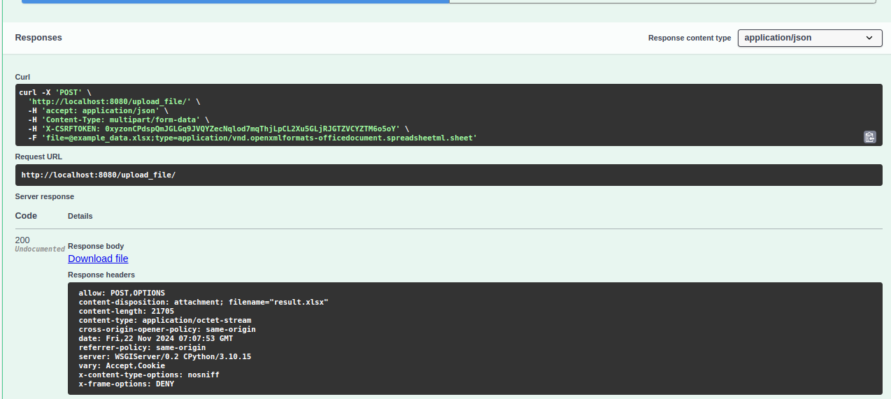

## Запуск работы 
Перед запуском docker контейнера необходимо убедиться в наличии .env файла.  
Запуск docker-compose:
```
docker compose up
```
После сборки docker создадутся два контейнера: postgres(хранение данных PostgreSQL) и django_app(само приложение Django).  

## Обработка файла
Для того чтобы протестировать выполненное задание, нужно открыть Swagger моего проекта:  
```
http://localhost:8080/swagger/
```


Перед вами будет расположен эндпоинт, который обрабатывает входные данные и возвращает результирующий файл формата .xlsx по требованиям ТЗ.  


Нажмите __Try it out__, затем прикрепите файл с данными и нажмите __Execute__.

